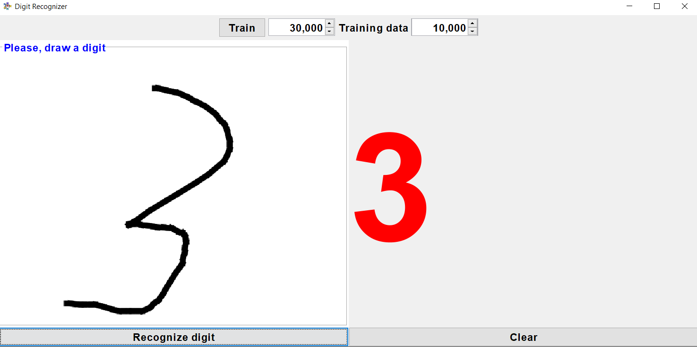

# Digit Recognizer
###### Using simple convolutional neural network (CNN) to recognize a handwritten digit. The model was trained using [MNIST](http://yann.lecun.com/exdb/mnist/) dataset.
The project is kinda "Hello, world!" application in neural network programming. The application allows to see CNN for handwritten digit recognition in work. The main feature is ability to draw your own digit and see if the neural network can recognize the drawn digit correctly. It can provide better understanding of how digits appear to CNN and which features of an image are crucial to making predictions.

---
###### Used tools:
- [Deeplearning4j](https://deeplearning4j.konduit.ai/) - working with neural network (building a CNN model, using MNIST dataset for training, making predictions and so on)
- [Lombok](https://projectlombok.org/) - @Getter, @Setter and other useful annotations
- [JUnit Jupiter](https://junit.org/junit5/) - Parametrized test
- [Java Image Scaling](https://mvnrepository.com/artifact/com.mortennobel/java-image-scaling) - Image scaling
- [Log4j](https://logging.apache.org/log4j/2.x/) - Logging
- ***Java 18*** _(records are used)_
---
###### Used references:
- [Deeplearning4j tutorials](https://github.com/deeplearning4j/deeplearning4j-examples/blob/master/dl4j-examples)
- [Digit recognizer](https://github.com/klevis/DigitRecognizer)

## How to install and run
#### Simple way to install and run application: 
Download [**RunMe.jar**](https://drive.google.com/file/d/1xDjabq2cocN10saV70EkI-ETrMfyR9pJ/view?usp=sharing) and run it (double click or using console `java -jar RunMe.jar`)

#### Using Intellij IDEA
1. Download the project (you can do it in several ways, but I'd recommend to use `git copy`)
2. File -> Open -> pom.xml (choose pom.xml from downloaded project) -> Open as project
3. Choose Main.java in IDE
4. Run it using 'Run' button or pressing Shift+F10

**Note:** _make sure that all required dependencies were resolved. For that you need reload maven changes (Ctrl + Shift + O) in **pom.xml** opened in IDE._
#### Using Maven (includes building _.jar_ file)
1. `mvn clean verify` (or press appropriate operations in IDE)
2. `java -jar target/DigitRecognizer-1.0-SNAPSHOT-shaded.jar`

## How to use
***Note:*** _the CNN doesn't provide 100% accuracy, so prediction mistakes happen_
1. [Run](https://github.com/Sergey-Dyakonov/DigitRecognizer/blob/master/README.md#how-to-install-and-run) the app
2. Draw a digit in special area
3. Press "Recognize digit"
4. Observe the result
5. Press "Clear" to clear drawing area and prediction and draw again

**If you prefer to train model by yourself or change it, specify required data amount with spinners and press "Train". It may take a while. The speed of training depends on your machine characteristics. After training finishing the new model will be saved on your computer and used for digit recognition. Trying specifying different amounts of data you can observe accuracy changing.**

## App in work

## App testing
There are simple test in the project to test neural network model. There are samples of digits drawn in this app in *.png* format. Trained model makes correct predictions about them. You can use it for testing your model.

## Future improvements
Future improvements may include:
- Adding functionality for specify what processor to use for training: GPU or CPU
- Changing progress bar during neural network (NN) training to represent actual progress of the training (depending on epochs, accuracy and so on), not only just "NN is being trained now"
- Adding functionality to correct the network if it missed (e.g. User will be able to choose if the network made true or false prediction and enter correct answer. NN will save drawn digit with correct answer and will use it in further training and model improving)
- Adding GUI functionality to choose setting for training such as learning rate, number of epochs, activation functions etc.
- Adding functionality to build a model through a GUI and also get UI model representation

---
Please, contact me if you have any ideas or questions

Email: *sergeidyakonov222@gmail.com*
